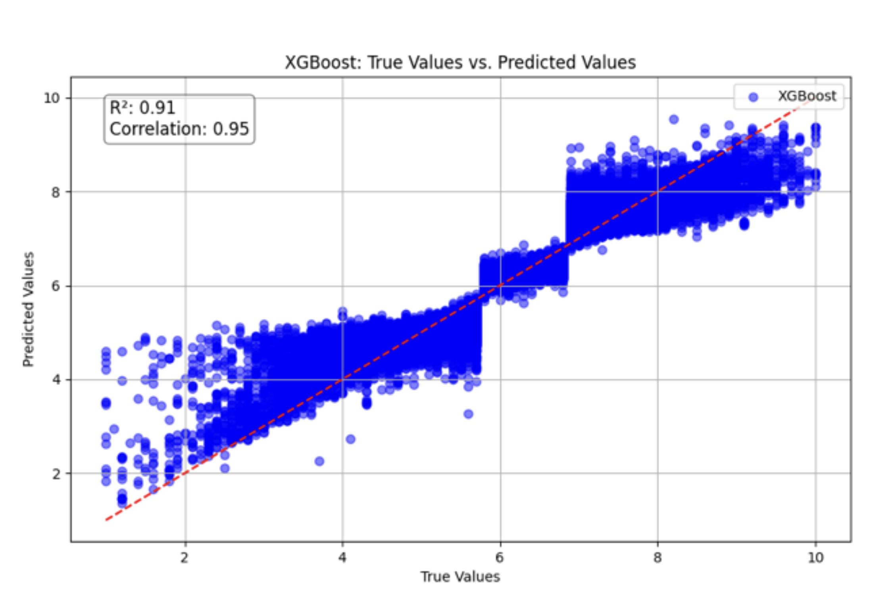

# A Machine Learning Exploration of Movie Success Factors

[cite_start]This project, developed as part of a Master of Science in Business Analytics, investigates the predictive factors of movie success using advanced machine learning models on a comprehensive IMDb dataset. [cite: 4, 993, 1022] [cite_start]The analysis explores various statistical and machine learning techniques, including Linear Regression, Random Forest, Gradient Boosting, and XGBoost, to identify the elements that significantly influence audience ratings. [cite: 1022]

## Key Findings & Visualizations

[cite_start]The analysis revealed that a movie's runtime, genre, and director influence are pivotal in determining its success. [cite: 1024] [cite_start]After hyperparameter tuning, the XGBoost model emerged as the most reliable predictor. [cite: 1684]

* [cite_start]**Top Predictors:** The most influential features in predicting movie ratings were `success_classification`, `numVotes`, `genres`, and `runtimeMinutes`. [cite: 57, 58, 1416, 1693]
* [cite_start]**Best Model:** The final tuned XGBoost model achieved an **R-squared of 0.91** and a **Correlation Coefficient of 0.95**, indicating a strong fit and high predictive accuracy. [cite: 60, 1684]
* [cite_start]**Runtime's Role:** Movies with longer runtimes (>120 minutes) demonstrated the highest success rate. [cite: 1354]
* [cite_start]**Genre Trends:** "Drama" consistently remains the most popular genre in the dataset. [cite: 1326]

### XGBoost Model Performance

## Tech Stack
The project was implemented in Python, leveraging the following core libraries for data manipulation, analysis, and modeling:
* [cite_start]**Python** [cite: 20]
* [cite_start]**Pandas:** For data manipulation and analysis. [cite: 24]
* [cite_start]**NumPy:** For powerful numerical operations. [cite: 25]
* [cite_start]**Matplotlib & Seaborn:** For data visualization. [cite: 26]
* [cite_start]**Scikit-learn:** For model selection, preprocessing, and evaluation. [cite: 27]
* [cite_start]**XGBoost:** For building the final high-performance gradient boosting model. [cite: 28]

## Project Structure
The repository is organized as follows:

-   **/data:** Contains the raw IMDb datasets. *(Note: This folder is not tracked by Git, as specified in the .gitignore file).*
-   [cite_start]**/reports:** Contains the final research and technical reports in PDF format. [cite: 5, 7]
-   **/scripts:** Includes the main Python script (`movie_analysis.py`) used for data processing, modeling, and evaluation.
-   **/visualizations:** Contains all charts and plots generated during the analysis.

## Data Source
[cite_start]The dataset was sourced from IMDb's official non-commercial datasets. [cite: 1139] [cite_start]It includes movie information on titles, crew, ratings, and more for films released between 2016 and 2024. [cite: 1022, 1142]

## Usage
To run this project locally:

1.  Clone the repository:
    `git clone https://github.com/your-username/Movie-Success-Prediction.git`
2.  Navigate to the project directory:
    `cd Movie-Success-Prediction`
3.  (Recommended) Create and activate a virtual environment.
4.  Install the required libraries (you can create a `requirements.txt` file for this).
5.  Run the analysis script:
    `python scripts/movie_analysis.py`

## License
This project is licensed under the MIT License. See the `LICENSE` file for details.